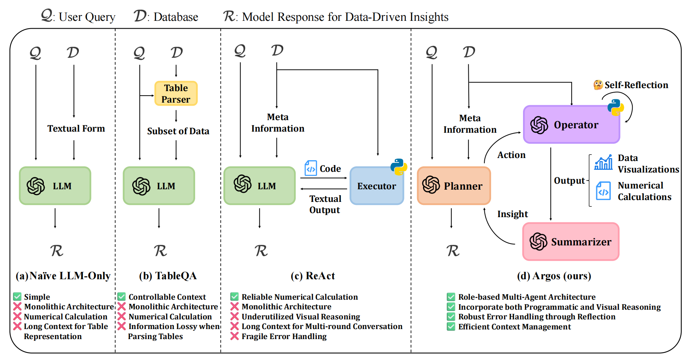
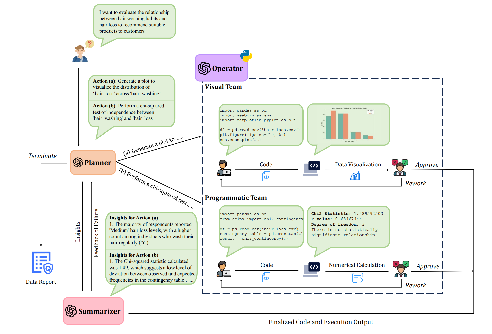
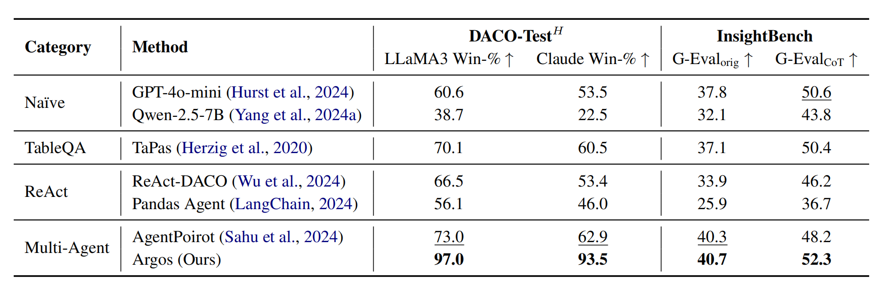

# Argos: Vision Makes Perceptive Analysts

> Icon generated by GPT-4o

Argos is a novel multi-agent data analysis system that leverages **role-based collaboration**, integrates **visual and programmatic reasoning**, and employs **reflection-based error mitigation** for end-to-end automation. 

## Overview

Traditional data analysis requires significant expertise, limiting accessibility for non-experts. Despite recent advancements in LLM-based data analysis systems, several challenges remain:

- **Monolithic Architectures:** Many existing systems rely on single-agent frameworks or simplistic wrappers around LLMs, lacking global planning and role-based coordination. This results in inadequate or redundant task decomposition.
- **Underutilized Visual Reasoning:** While some systems incorporate visualizations, they often reduce visual information to text-based representations, losing valuable insights obtainable through direct visual interpretation.
- **Fragile Error Handling:** Current methods lack robust mechanisms for error correction, often leading to cascading errors or overly cautious strategies that limit analytical depth.

Argos addresses these limitations through a multi-agent framework that integrates **visual and programmatic reasoning** within a **Plan-Operate-Summarize paradigm**. The system offers:

- **Role-based Collaboration:** Argos introduces specialized agents—Planner, Operator, and Summarizer—to enhance efficiency and robustness.
- **Visual and Programmatic Reasoning:** By directly reasoning over visual data, Argos captures insights that traditional text-based approaches often overlook.
- **Reflection-Based Error Mitigation:** A feedback-driven mechanism that iteratively corrects errors, enhancing reliability and analytical accuracy.

## System Architecture

Argos follows a **Plan-Operate-Summarize paradigm**, including:

1. **Planner:** Decomposes complex tasks into smaller actions and orchestrates workflow.
2. **Operator:** Performs computation and visualization, interacting with data and generating insights.
3. **Summarizer:** Compiles generated insights into a cohesive report, ensuring interpretability.

## Experiment

### Benchmark

- [DACO](https://github.com/shirley-wu/daco): DACO comprises hundreds of structured data analysis instances generated by large language models and subsequently refined by human experts. The dataset spans ten diverse topics, such as business, sports, healthcare, and education. Each instance provides a varying number of tabular datasets along with a vague query, requiring the model to generate a comprehensive data report in an end-to-end manner. The report is expected to contain a series of insightful findings and actionable suggestions. Evaluation is performed on a human-refined test set ($\text{Test}^H$) consisting of 100 instances. DACO employs Claude-3.5-Sonnet and LLaMA-3-8B to assess the model's output by comparing its win rate against reference reports in terms of helpfulness. Particularly, we exclude GPT-4o-mini as an evaluator from the original paper to avoid the issue highlighted by Panickssery et al. (2024), where an evaluator also serves as a participant.

- [InsightBench](https://github.com/ServiceNow/insight-bench): InsightBench consists of 100 business-related data analysis cases, each featuring a curated set of insights along with corresponding visualizations. Given a database and an analytical goal, the model is expected to perform end-to-end data analysis, including question formulation, result interpretation, and the generation of insightful summaries with actionable recommendations. Evaluation is conducted using [G-Eval](https://github.com/nlpyang/geval), which quantifies the similarity between model-generated summaries and the ground truth. Additionally, we identified certain limitations in the original evaluation methodology of InsightBench (discussed in detail in the Appendix). To address these issues, we improved the G-Eval evaluation process by incorporating chain-of-thought (CoT) reasoning capabilities and more detailed evaluation criteria. We report results using both the original G-Eval method (denoted as G-Eval$_{\text{orig}}$) and our improved version with CoT reasoning (denoted as G-Eval$_{\text{CoT}}$).

**Note:** There are minor issues related to missing metadata in the InsightBench dataset. For more information, see [Missing Metadata [Issue-#7]](https://github.com/ServiceNow/insight-bench/issues/7). We have fixed this in our local version. Please double-check if you download the data from the original source.

### Result

## Usage

### Minimal GPT-4o-mini Practice

1. Run the script `script/preprocess_work_dir.py` to setup the virtual environment. (To run Argos in a Jupyter notebook, set `--require_jupyter`)

2. Follow the instructions in `playground/minimal.ipynb`.

### Full Replication

1. Create a virtual Python executor environment as described above.
2. Preprocess the datasets using `script/preprocess.sh`
3. Setup your evaluation environment.
4. Follow the instructions in `playground/replicate.ipynb`. Note that results may slightly differ due to random generation, but should be close to the reported results.

### Deploy on Open-source Models

1. Create a virtual Python executor environment as described above.
2. Serve the open-source models using OpenAI-compatible servers (please refer to [vLLM](https://github.com/vllm-project/vllm) or [SGLang](https://github.com/sgl-project/sglang)).
3. Follow the instructions in `playground/custom.ipynb`.

### Deploy with Gradio

**(Under development, coming soon)**

1. Create a virtual Python executor environment as described above.
2. Follow the instructions in `playground/gradio.ipynb`

## FAQ

1. **Errors**

   - `ValueError: Key backend: 'module://matplotlib_inline.backend_inline' is not a valid value for backend; supported values are...`: This error occurs when Argos is run within a Jupyter notebook and either `matplotlib_inline` or `ipython` is not installed in the virtual environment. To fix this, use `script/install_venv_packages.py --require_jupyter` to install the necessary packages.

   - `This model's maximum context length is 32768 tokens. However, you requested...`: This error occurs when deploying Qwen2.5 as the Planner/Reflector with excessive input tokens (original max context length: 32768). To resolve this, enable YaRN within vLLM by setting `--rope-scaling '{"factor": 4.0, "original_max_position_embeddings": 32768, "rope_type": "yarn"}'`. Note (according to Qwen2.5's official blog): *vLLM only supports static YARN, meaning the scaling factor remains constant regardless of input length, potentially impacting performance on shorter texts.*

   - `At most 1 image(s) may be provided in one request...`: This error is due to the default `--limit-mm-per-prompt` setting in vLLM. Increase this limit to allow more images per request.

2. **Can I use open-source models?**
   Yes, but only OpenAI-like API calls are supported. It's recommended to serve your models using vLLM or SGLang. We provide a demo configuration at `config/Qwen-series-demo.json` and a demo jupyter notebook at `playground/custom.ipynb`. The detailed setting for Qwen-series is:
   - `Qwen2.5-VL-72B-Instruct` for Visual-Reflector and Summarizer.
   - `Qwen2.5-72B-Instruct` for Planner.
   - `Qwen2.5-Coder-32B-Instruct` for Visual- and Programmatic-Coder.
   This setting achieve 86.5 on DACO (evaluated by Llama-3), surpassing all the baselines equipped even with GPT-4o-mini.
   However, if models with smaller size are adopted (especially small VL-models for Summarizer), we've found that the poor text-only instruction-following ability strongly decrease the overall performance (with ~7B Qwen series models, Argos achieve only 65.8 on DACO, though it's still higher than most of baselines equipped with GPT-4o-mini, we think it's not enough). We are seeking a way to decouple Summarizer to fix this. (See the fourth point of Minor Code Issues below)

3. **Python version compatibility:**
   Argos has been tested with Python 3.12 but should work well with versions above 3.10 (required by AutoGen framework).

   

## Existing Limitations

While Argos demonstrates strong performance in automated data analysis, we acknowledge that the full potential of LLM-driven data analysis systems remains untapped. Below, we outline key limitations and directions for future improvements.

1. *Cost Considerations:* Although Argos manages to balance performance and token efficiency, redundancy in multi-turn conversations and detailed system prompts remain bottlenecks. Future work could mitigate these inefficiencies by employing caching or memory-based strategies to reduce redundant exchanges or by embedding agent guidelines directly into model parameters via efficient fine-tuning.

2. *Instruction Following:* Despite architectural enhancements, Argos occasionally exhibits instruction-following failures due to inherent limitations in the base language model, particularly in complex queries. (We provide a negative case in the Appendix of the paper) One potential solution is leveraging reinforcement learning to improve preference alignment and adherence to task specifications.

3. *Task Planning Efficiency:* Argos' reliance on sequential task planning constrains processing throughput, particularly in workflows with independent subtasks. Future iterations could improve efficiency by implementing parallelized execution for independent actions, reducing overall task completion time.

4. *Unnecessary Visual Reasoning:* Argos sometimes performs unnecessary visual reasoning, which may increase token overhead. We aim to improve this in future iterations.

5. *Existing Code Issues:*

   - Planner currently supports only JSON output, which may conflict with the reasoning process of models like DeepSeek-R1. We are considering using a more flexible schema to address this issue.
   - The Executor currently only recognizes images saved using `plt.savefig('some-fixed-filename.png')`. If the filename is dynamic (e.g., using an f-string or formatting), it is ignored. A temporary fix is added to the criteria system prompt of Coders.
   - Using open-source text-only models (e.g., Qwen2.5-Coder) as Visual-Coder may cause issues when handling multi-modal input. Adding remove_images=True in the visual coders can mitigate this problem.
   - Vision-supported models (e.g., Qwen2.5-VL) as Summarizer may fail in programmatic cases due to insufficient text-only instruction-following training. A potential solution is to split Summarizer into two proxy models (text-only and vision-supported).

## Citation

Our arxiv paper is comming soon. 

